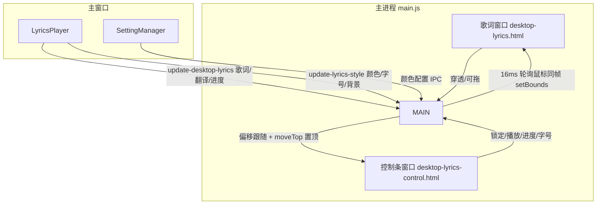
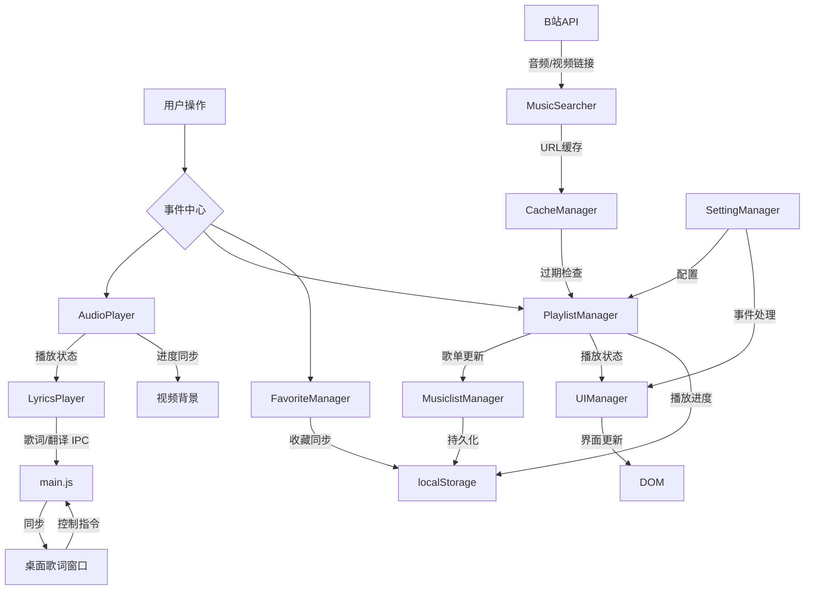

# NB Music


> 本项目为 [NB-Group/NB_Music](https://github.com/NB-Group/NB_Music) 的 fork（dev-mods 分支），在原项目基础上重构了界面布局并扩展桌面歌词、翻译等能力。

基于 Electron 的音乐播放器，音频资源直接来自哔哩哔哩，无需 VIP 即可播放全网音乐。歌词来自网易云音乐。

依赖的开源项目：
- [neteasecloudmusicapi](https://gitlab.com/Binaryify/neteasecloudmusicapi) 网易云 API
- [Bilibili API Collect](https://github.com/SocialSisterYi/bilibili-API-collect) B站 API

---

## 功能特性

### 播放与布局
- 现代布局：侧边栏导航 + 底部常驻播放条 + 播放列表右下抽屉，可一键定位当前歌曲
- 侧边栏宽度可拖拽调整（150px~400px），宽度记忆持久化
- 播放模式支持「预随机」：整表洗牌后按序播放（列表可见、一轮不重复），非系统乱序
- 纯享模式：点击播放条封面进入，隐藏全部 UI 只留底部播放条与全屏背景，ESC 或点击空白退出

### B站相关
- 自动抓取最高音质音频（登录大会员账号可听 Hi-Res）
- 收藏夹一键导入为歌单
- 三种背景模式：封面 / 视频 / 无；视频背景与音频播放、暂停、跳转同步；背景模糊强度 0~100 可调（0 为完全关闭）

### 歌词
- 网易云自动抓取歌词，逐字逐句高亮
- 歌词翻译：网易云 tlyric/yrcTlyric 按时间戳自动配对，主窗口与桌面歌词均显示翻译（小字）
- 手动搜索歌词：搜索出候选列表后由用户点选，不自动取第一个结果
- 歌词偏移手动调节，点击歌词行跳转自动扣除偏移量

### 桌面歌词
- 双窗口架构：歌词窗口（纯展示）+ 控制条窗口（锁定 / 播放暂停 / 进度 / 字号 / 关闭）
- 锁定后歌词窗口鼠标穿透、不挡操作，控制条仍可点击；解锁后可拖动歌词窗口，控制条同帧同步跟随
- 控制条可展开 / 收起（完整条 ↔ 小圆点），位置、锁定、展开状态均持久化
- 歌词与翻译颜色可在设置中配置

---

## 用户指南

- 下载：[Releases](https://github.com/NB-Group/NB_Music/releases)
- 歌曲加载失败：多点几次播放键（内置重试机制）
- 歌词与音频对不上：检查搜索关键词，或在设置中切换歌词来源（B站字幕 / 网易云）
- 桌面歌词无法点击：处于锁定状态（默认开启），鼠标穿透；点控制条锁定按钮解锁后即可拖动
- 其他问题：提交 [Issues](https://github.com/NB-Group/NB_Music/issues)

---

## 开发者文档

### 技术栈

- Electron - 跨平台桌面应用框架
- HTML DOM API - 音频处理
- 原生 CSS - 界面样式
- Yarn - 包管理器
- GitHub Actions - CI/CD

### 核心模块

```bash
├──  icons/                        # 项目图标资源
├──  img/                          # 项目图像资源
├──  public/                       # 公共资源文件夹
├──  src/                          # 源代码文件夹
│   ├──  javascript/               # JavaScript文件
│   │   ├──  AudioPlayer.js        # 音频播放器
│   │   ├──  CacheManager.js       # 缓存管理器
│   │   ├──  FavoriteManager.js    # 收藏管理器
│   │   ├──  LoginManager.js       # 登录管理器
│   │   ├──  LyricsPlayer.js       # 歌词播放器（含翻译配对、桌面歌词同步）
│   │   ├──  MusicSearcher.js      # 音乐搜索器（网易云/B站，候选选择）
│   │   ├──  MusiclistManager.js   # 歌单管理器
│   │   ├──  PlaylistManager.js    # 播放列表管理器（预随机洗牌、视频背景）
│   │   ├──  SettingManager.js     # 设置管理器
│   │   ├──  SidebarResizer.js     # 侧边栏宽度拖拽
│   │   ├──  UIManager.js          # UI管理器（纯享模式、进度显示）
│   │   ├──  UpdateManager.js      # 更新管理器
│   ├──  main.html                 # 主界面
│   ├──  main.js                   # 主进程（桌面歌词双窗口、拖动同步、位置记忆）
│   ├──  desktop-lyrics.html       # 桌面歌词窗口（纯展示 / 穿透 / 拖动）
│   ├──  desktop-lyrics-control.html # 桌面歌词控制条窗口
│   ├──  mobile.js                 # 移动端适配
│   ├──  script.js                 # 启动装配脚本
│   ├──  splash.html               # 启动画面
│   ├──  styles/                   # 样式
│   │   ├──  base.css              # 基础样式
│   │   ├──  components/           # 组件样式
│   │   │   ├──  desktop-lyrics.css # 桌面歌词样式
│   │   │   ├──  lyrics.css        # 歌词样式（含翻译行）
│   │   │   ├──  playerbar.css     # 底部播放条（含纯享模式）
│   │   │   ├──  sidebar.css       # 侧边栏样式
│   │   │   └──  ...               # 其余组件样式
│   │   ├──  index.css             # 入口样式
│   │   ├──  variables.css         # CSS 变量
│   ├──  utils.js                  # 工具函数
```

### 桌面歌词双窗口架构



实现要点：
- 歌词窗口为拖动主体（未锁定），控制条按固定偏移同帧跟随，避免双窗口相对滑动
- 高频 `setPosition` 在非 100% DPI 下存在尺寸漂移，统一改用 `setBounds` 显式固定尺寸
- 控制条窗口每帧 `moveTop` 置顶，防止歌词窗口移动时遮挡按钮
- 位置、锁定、展开状态持久化到 localStorage 与 userData

### 数据流向



### 开发

```bash
yarn install   # 安装依赖
yarn run run   # 直接运行
yarn debug     # 调试主进程
yarn build     # 打包
```

代码规范：
- 组件化、面向对象
- 使用 Yarn
- 代码经 Prettier 格式化、ESLint 检查
- 编写注释
- 文件放入对应目录，不散落根目录

---

## 版权说明

开源协议：[GPL-3.0](LICENSE)

本项目 fork 自 [NB-Group/NB_Music](https://github.com/NB-Group/NB_Music)。代码开源，但受《中华人民共和国著作权法》保护，禁止一切商业行为（包括打包售卖、未经允许的搬运）。用于学习交流请标注作者与项目链接。
