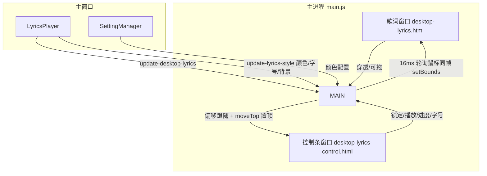
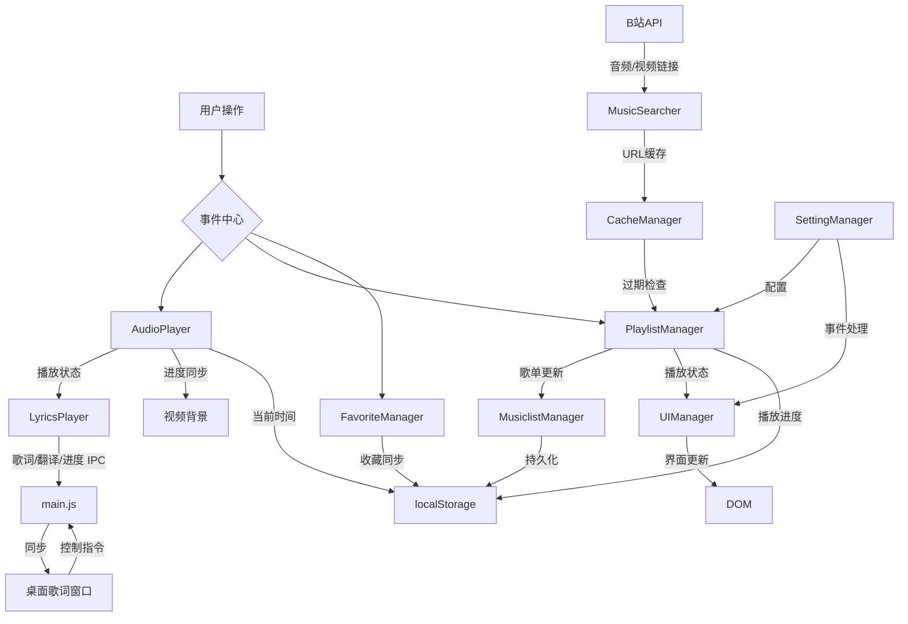

# NB Music


## 简介
由NB-Group和User782Tec两名初中生开发的跨平台音乐播放器！无需VIP就能畅听全网音乐，因为我们直接从哔哩哔哩获取音频资源~
这里有：
- 全网音乐自由播放（包括其他平台要VIP的歌曲！）
- 一键导入B站收藏夹当歌单
- 智能歌词捕捉系统（自动匹配+手动补全双保险）
- ECHO 风格布局：侧边栏导航 + 底部常驻播放条 + 播放列表右下抽屉
- 桌面歌词：独立双窗口（歌词 + 控制条），支持穿透/锁定/拖动/翻译

哦，对了！我们主要基于以下开源项目，感谢他们！
- [neteasecloudmusicapi](https://gitlab.com/Binaryify/neteasecloudmusicapi) 网易云API(Github仓库已经寄了)
- [BillBill Api Collect](https://github.com/SocialSisterYi/bilibili-API-collect) B站API
---

## 用户指南

### 下载
[Releases](https://github.com/NB-Group/NB_Music/releases)查看最新版本喵！
话说应该会有自动更新的，代码里写了的（）

### 特色功能说明书

**B站相关**
- 我们从B站自动抓取最高音质版本（悄悄说：登录带大会员的账号才能听Hi-Res的QwQ）
- 收藏夹一键导入歌单（一点迁移成本都没有哦）
- 播放模式支持「预随机」：整表洗牌后按序播放（列表可见、一轮不重复），不依赖系统乱序

**布局与交互**
- ECHO 风格：左侧纯导航（播放/收藏/歌单/设置），底部常驻播放条（封面/歌名/控制/进度/音量/列表），播放列表为右下抽屉，可一键定位当前歌曲
- 侧边栏宽度可拖拽调整（150px~400px，记忆上次宽度）
- 纯享模式：点击播放条左侧封面进入（参考 ECHO MV 模式），隐藏全部 UI 只留底部播放条与全屏背景，ESC / 点击空白退出

**歌词相关**
- 从网易云自动抓取歌词，支持逐字逐句高亮
- 歌词翻译：网易云 tlyric/yrcTlyric 按时间戳自动配对，主窗口歌词行与桌面歌词均显示翻译（小字）
- 自动匹配的歌词不对？可以手动搜索（设置里可选）：搜索出候选列表后**自己点选**，绝不自动取第一个
- 歌词偏移支持手动调节，点击歌词行跳转会正确扣除偏移量

**桌面歌词**
- 独立双窗口：歌词窗口（纯展示）+ 控制条窗口（锁定/播放/进度/字号/关闭）
- 锁定后歌词窗口鼠标穿透（不挡操作），控制条仍可点击；解锁后可拖动歌词窗口，控制条严丝合缝跟随（同帧同步）
- 控制条可展开/收起（300px 完整条 ↔ 24px 圆点），位置/锁定状态/展开状态均持久化
- 歌词与翻译颜色可在设置中配置（默认主题色）

**背景相关**
- 封面 / 视频 / 无 三种背景模式；视频背景与音频播放/暂停/跳转同步
- 背景模糊强度 0~100 可调，0 即完全关闭

**🛠️ 遇到问题怎么办？**
- 歌曲加载失败→多点几次播放键（我们的重试机制超顽强！）
- 其他bug→对着屏幕说"修好它！"（然后重启应用就OK啦~才怪！要记得反馈给我们哦）
- 当然，修bug最重要的提交issues啦！

**❓常见问题**

- 为什么我的字幕和音频对不上？
- - 答：
- - 检查关键词是否正确
- - 或者在设置里把歌词来源改成b站字幕（1.0.3更新）
- - 或者在设置里把歌词来源改成网易云
- 桌面歌词为什么点不了？
- - 那是锁定状态（默认开启），鼠标可穿透；点控制条的锁定按钮解锁后即可拖动
- 剩下的问题可以提出issues，或者加我们的交流群（QQ：228969652）询问哦

---

## 开发者文档

### 架构设计

#### 技术栈

- 🚀 Electron - 跨平台桌面应用开发框架
- 🎵 Html Dom API - 音频处理
- 🎨 原生 CSS - 界面样式
- 📦 Yarn - 包管理器
- 🔄 GitHub Actions - CI/CD

#### 核心模块
```bash
├──  icons/                       # 项目图标资源
├──  img/                         # 项目图像资源
├──  public/                      # 公共资源文件夹
├──  src/                         # 源代码文件夹
│   ├──  javascript/              # JavaScript文件
│   │   ├──  AudioPlayer.js       # 音频播放器功能
│   │   ├──  CacheManager.js      # 缓存管理器
│   │   ├──  FavoriteManager.js   # 收藏管理器
│   │   ├──  LoginManager.js      # 登录管理器
│   │   ├──  LyricsPlayer.js      # 歌词播放器（含翻译配对、桌面歌词同步）
│   │   ├──  MusicSearcher.js     # 音乐搜索器（网易云/B站，候选选择）
│   │   ├──  MusiclistManager.js  # 歌单管理器
│   │   ├──  PlaylistManager.js   # 播放列表管理器（预随机洗牌、视频背景）
│   │   ├──  SettingManager.js    # 设置管理器
│   │   ├──  SidebarResizer.js    # 侧边栏宽度拖拽
│   │   ├──  UIManager.js         # UI管理器（纯享模式、进度显示）
│   │   ├──  UpdateManager.js     # 更新管理器
│   ├──  main.html                # 主要HTML文件
│   ├──  main.js                  # 主进程（桌面歌词双窗口、拖动同步、位置记忆）
│   ├──  desktop-lyrics.html      # 桌面歌词窗口（纯展示/穿透/拖动）
│   ├──  desktop-lyrics-control.html # 桌面歌词控制条窗口（锁定/播放/进度/字号/收起）
│   ├──  mobile.js                # 手机适配js文件
│   ├──  script.js                # 辅助脚本
│   ├──  splash.html              # 启动画面HTML
│   ├──  styles/                  # 样式文件夹
│   │   ├──  base.css             # 基础样式
│   │   ├──  components/          # 组件样式
│   │   │   ├──  animations.css   # 动画样式
│   │   │   ├──  controls.css     # 控件样式
│   │   │   ├──  desktop-lyrics.css # 桌面歌词样式
│   │   │   ├──  dialogs.css      # 对话框样式
│   │   │   ├──  lyrics.css       # 歌词样式（含翻译行）
│   │   │   ├──  musiclist.css    # 歌单样式
│   │   │   ├──  notifications.css # 通知样式
│   │   │   ├──  player.css       # 播放器样式
│   │   │   ├──  playerbar.css    # 底部播放条样式（含纯享模式）
│   │   │   ├──  settings.css     # 设置样式
│   │   │   ├──  mobile.css       # 手机适配样式
│   │   │   ├──  sidebar.css      # 侧边栏样式
│   │   │   ├──  song.css         # 歌曲样式
│   │   │   ├──  titlebar.css     # 标题栏样式
│   │   ├──  index.css            # 首页样式
│   │   ├──  utilities.css        # 辅助样式
│   │   ├──  variables.css        # 变量样式
│   ├──  utils.js                 # 工具函数
```

#### 桌面歌词双窗口架构


#### 数据流向


### 贡献指南
1. 克隆仓库后执行 `yarn install --magic`（开玩笑的，正常install就好）
2. 调试主进程：`yarn debug`
3. 直接运行: `yarn run run`
4. 打包: `yarn build`
5. 代码规范：
   - 一定要组件化哦！面向对象启动！
   - 用yarn！
   - 记得用prettier格式化一遍，用eslint检查一遍喵。
   - 记得写注释，写注释，写注释！
   - 不要把文件放在根目录喵！
   - 其它没啥，代码合理即可。
   - 求大佬PR（雾）
6. 提PR时请附上猫耳表情包以通过审核（大雾）

---

**版权说明**
开源协议：[GPL-3.0](LICENSE)
开发团队：NB-Group和User782Tec这两名初中生（作业没写完也要写代码的传说！）（其实我们成绩都很好的啦）

尽管我们代码开源，但我们仍受《中华人民共和国著作权法》的保护。
禁止一切使用我们源代码的商业行为，包括但不限于，打包售卖、未经允许的搬运等。
（上次我们的Win12就被倒卖源码了QwQ）
如果用于学习交流，那么请便，但是务必标注作者和项目链接哦。

其它条款请见 [GPL-3.0](LICENSE) 协议文本。
